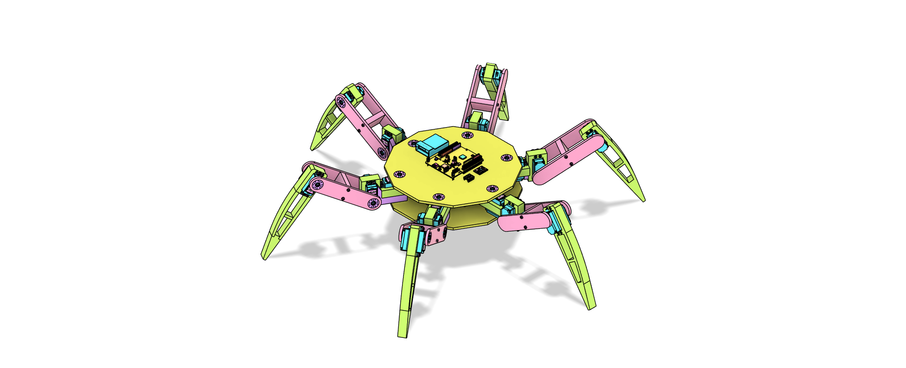

# Hexapod Robot

Hexapod project just for fun and learning purposes. In this project I'm using STM32F446RE with FreeRTOS and implementing new modules from time to time.  

Mechanical design, electrical design, and all code (except STM HAL library and standard startup codes) belong to me. During the process, I'm not using a specific resource.

---

## Table of Contents

- [TODO List](#todo-list)
- [Folder Structure](#folder-structure) 
- [Guide & Explanation](#guide&explanation)
- [Acknowledgments](#acknowledgments)  
- [Disclaimer](#disclaimer)  
- [Contribution](#contribution)  
- [License](#license) 

---

## TODO List 

- [x] STM32 pin and clock configuration  
- [x] STM32 FreeRTOS setup  
- [x] Leg design  
- [ ] Body design (60%)  
- [x] Electronics  
- [ ] Touch sensor design  
- [x] Power management and calculations (improvements planned for future updates)  
- [ ] Kinematic functions  
- [ ] Servo motor control with kinematic functions  
- [ ] SD card data logging  
- [x] MPU6050 library  
- [ ] MPU6050 usage and data calibration  
- [x] PCA9685 library  
- [ ] SD card library  
- [ ] Walking algorithms  
- [ ] IMU data implementation into walking algorithms  
- [ ] Gait pattern optimization  
- [x] FlySky controller setup  
- [x] FlySky receiver setup  
- [ ] Communication interface integration (UART / I2C data sync)  
- [ ] Multi-threaded FreeRTOS task scheduling for movement, control, and sensors  
- [ ] System debugging and telemetry  
- [ ] Performance tuning and timing analysis  
- [ ] High-level software and AI implementation  
- [ ] Documentation and cleanup (lol)

---

## Folder Structure

- [Mechanical Design](./mechanical_design/)
- - [Leg Design](./mechanical_design/leg/)
- - [Body Design](./mechanical_design/body/)
- - [Electronics](./mechanical_design/electronics/)
- - [Components](./mechanical_design/components/)
- [Electronic Design](./electronic_design/)
- [Embedded Software](./embedded_software/Core/)
- - [Include](./embedded_software/Core/Inc/)
- - [Source](./embedded_software/Core/Src/)
- [High Level Software](./high_level_software/)

---

## Guide & Explanation

This section provides an overview of how the Hexapod Robot works — from mechanical structure to software logic and control flow.

### 1. Mechanical Overview

The hexapod has 6 legs, each driven by 3 servo motors: coxa, femur, and tibia joints. The current design focuses on stability and symmetrical movement.  
The servos are controlled through the PCA9685 PWM driver, which communicates with the STM32 over the I2C bus.

- 3D printed parts were modeled in Fusion 360.
- The mechanical design will continue evolving to support smoother walking and better weight balance.

### 2. Electronics Overview

The electronic system is built around the STM32F446RE microcontroller.

#### Main components:

- STM32F446RE (main controller)  
- PCA9685 (16-channel PWM driver for servos)  
- MPU6050 (IMU sensor for orientation and movement feedback)  
- SD Card Module (for future data and telemetry logging)  
- FlySky Receiver (for manual control input)  
- Power management module (LiPo battery + regulator)

All communication between modules is handled via I2C, SPI and UART depending on the peripheral.

### 3. Software Architecture

The firmware is based on FreeRTOS, providing multi-threaded task management and control over timing and priorities.

#### Current Tasks:

- **Servo Task:** Generates leg movement using PCA9685.
- **Sensor Task:** Reads IMU data (MPU6050) periodically.
- **Control Task:** Handles remote input and walking algorithms.
- **Logging Task:** Saves telemetry and sensor data to SD card.
- **Safety Task:** Monitors voltage, temperature, and sensor anomalies.

FreeRTOS ensures reliable real-time performance and modularity, making each subsystem independent and easy to maintain.

### 4. Kinematics & Motion

Each leg’s position is calculated using inverse kinematics (IK).  
The algorithm takes target coordinates (X, Y, Z) and computes required servo angles for the coxa, femur, and tibia joints.  
This allows precise movement such as walking, rotating, and adjusting posture.

Future updates will include:
- IMU-based body stabilization
- Adaptive gait algorithms

### 5. Future Plans

- Add touch sensors for terrain feedback.  
- Implement autonomous walking and pathfinding using sensor data.  
- Log performance data to SD card for gait optimization.
- Integrate AI modules for add-ons.

This section will be continuously updated as development progresses.

---

## Acknowledgments

I was inspired by [Rob's Tech Workbench](https://github.com/robs-tech-workbench/hexapod_spiderbot_model) and [Sir Kuhnhero](https://github.com/Sir-Kuhnhero/Hexapod)'s hexapod spider models when I started this project. I recommend checking out these repositories, as they contain various implementations and approaches for building hexapod robots.

---

# Disclaimer

Please exercise caution and read all safety guidelines when working with electronics and 3D printers. I'm not responsible for any damage caused during the build.

---

## License

Licensed under the MIT License. See [LICENSE](LICENSE.md) for details.